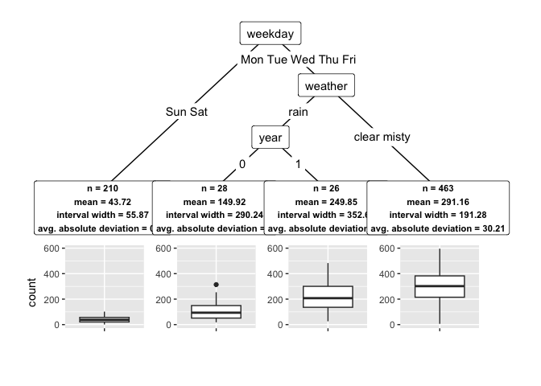

<!-- README.md is generated from README.Rmd. Please edit that file -->

# **`conftree`**: Subgroups with Trees using Conformal Prediction

<!-- badges: start -->

[](https://www.repostatus.org/#active)
[](https://github.com/holgstr/conftree/actions/workflows/R-CMD-check.yaml)
<!-- badges: end -->

This `R` package detects subgroups in machine learning models with
numeric outcomes (regression). It leverages
[CV+/Jackknife+](https://arxiv.org/abs/1905.02928) to simultaneously
optimize inter-group heterogeneity and intra-group homogeneity w.r.t.
the predicted target variable. In this way, it is an extension of the
`r2p` algorithm ([Lee et al., NeurIPS
2020](https://proceedings.neurips.cc/paper/2020/hash/1819020b02e926785cf3be594d957696-Abstract.html)).
`conftree` works with any of the
[100+](https://www.tidymodels.org/find/parsnip/) learning algorithms for
regression tasks available in `tidymodels`.

## Installation

You can install the current development version from GitHub with:

``` r
if (!require("remotes")) {
  install.packages("remotes")
}
remotes::install_github("holgstr/conftree")
```

## Quickstart

Let’s find subgroups in the Washington bike share data. We use
`tidymodels` to set a random forest as `learner`, a 5% miscoverage rate
as `alpha`, and 10-fold CV+ to quantify the uncertainty in the resulting
subgroups:

``` r
library(conftree)
library(tidymodels)
data(bikes)

set.seed(1234)

# Specify the learner to be used for model training:
randforest <- rand_forest(trees = 200) %>%
  set_mode("regression") %>%
  set_engine("ranger")

# Find optimal subgroups:
groups <- r2p(
  data = bikes,
  target = "count",
  learner = randforest,
  cv_folds = 10,
  alpha = 0.05,
  gamma = 0.2,
  lambda = 0.5,
  max_groups = 4
)

# Display tree structure:
groups$tree
#> [1] root
#> |   [2] weekday in Sun: *
#> |   [3] weekday in Mon, Tue, Wed, Thu, Fri, Sat
#> |   |   [4] weekday in Sat: *
#> |   |   [5] weekday in Sun, Mon, Tue, Wed, Thu, Fri
#> |   |   |   [6] temp <= 6.15: *
#> |   |   |   [7] temp > 6.15: *

# Plot:
plot(groups)
```

<!-- -->
